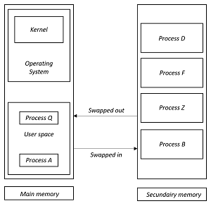

# Prose 'Let's allocate!'

**Content of this prose:**
```text
Content:
+ Introduction
| - + Research questions about allocators
| - + Applications of allocators
| - + Importance of allocators
| - + General goal of this prose
+ Obtaining memory from your operating system
```

## Introduction

In a computer program you can't get around it: variables. Values are stored here that are important in your program.
But there are several ways to allocate these variables. 

One way to do this is to dynamically allocate memory.
In this case, this allocation will have to take place on the heap. But this allocation is a complex problem in C++, along with C.
For example, memory allocation using `malloc` can be extremely slow if your operating system needs to contact its kernel to be able to allocate memory. This makes it possible to write an allocator yourself in order to influence performance.
There are also various allocators that you can implement yourself, such as a memory pool allocator. This allocator ensures, among other things, that less memory fragmentation takes place, and that the allocation of new elements is super-fast.

So: do you want to know everything about allocators? Then you've come to the right place! It examines how dynamic memory allocation works, along with the advantages and disadvantages associated with it. We also briefly look at algorithms that often require dynamic memory allocation. Finally, a memory pool allocator is written which is extensively tested (as also on its speed of memory allocation).

### Research questions about allocators

In connection with this prose, an examination is given. Various questions can be asked which must then be answered in this way. These questions naturally relate to the subject of allocators. The following research questions have been defined:

1. What are the advantages and disadvantages of using `::operator new` in C++ and `malloc` in C, among others? _The benefits of these allocators are examined. For example, you can see how quickly these allocators can allocate memory, and how quickly this memory is released again. In addition, there may also be a number of disadvantages associated with these allocators, which must of course be mentioned._
2. How does memory allocation work? _A very important aspect: how does your program actually get dynamic memory? Will your operating system be contacted, which will immediately return a fresh block of memory to you? Here it is mentioned, among other things, how memory is allocated dynamically._
3. What are the algorithms/data structures that often work with dynamic memory allocation? _Many complex data structures use memory that is dynamically allocated. For example for a `linked list`, or an `AVL tree`. These data structures also have its uses for efficiently executing different algorithms._
4. What types of allocators are there? _As you might expect, there are many types of allocators. Some allocators are super-fast, and return the requested memory almost immediately, while other allocators take a little longer._
5. How does a memory pool allocator work, and how do you implement this type of allocator? _Here is explained how a memory pool allocator works, and how it is implemented. And you can already feel it coming, this allocator can allocate memory very quickly._

### Applications of allocators

In many ways the use of a standard allocator is sufficient, you request an amount of memory, in order to be able to use it. But in some cases the use of these allocators can be very slow. If the speed of the execution of your program matters, it may be important for this reason that you have to implement an allocator yourself. For example, if you allocate a lot of small pieces of memory with `::operator new`, this can be very slow. The operating system must also be contacted continuously, which in the worst case must contact its kernel.

You would prefer to avoid this problem, so you have to implement an allocator yourself. For example, it is possible to allocate a large block of memory at hand, and then divide it into smaller chunks when you request new memory. In this case, there is no need to contact the operating system to obtain memory. The allocation in this case is in constant time.

In addition, it can also be an important reason to implement your own allocator if you do not want to deal with a large memory fragment, so that many blocks of memory have been allocated for a program.

Because with the implementation you can drastically reduce the execution and the number of resource requests for your program than the standard applications that a programming language offers, this application is often used in business. For this reason it is important to follow a further study on the use of dynamic memory, its applications and the various types of allocators. Within C++, allocators are also used within STL algorithms and STL containers. Underlying this, one uses `std::allocator<T>`, which you can also implement completely yourself. You can then state that algorithms must use the allocator that you have implemented yourself. For a further explanation, and mentioning the importance of allocators, reference is made to the section below in this prose.

### Importance of allocators

Allocators are objects that are responsible for encapsulating memory management. They must be able to allocate and deallocate memory. This should always be done in these two steps. In addition, many algorithms use allocators, for example STL algorithms in C++. For example, various algorithms use a certain signature for the allocation, which corresponds to a `std::allocator<T>`.

However, it is also possible to generate an allocator yourself, but this must then meet the same requirements as set for a `std::allocator<T>`. It is therefore important that one knows which properties a self-defined allocator must meet, in order to be able to actually use it in STL algorithms.

In addition, it is also possible by implementing your own `std::allocator<T>` to use an allocation method other than `::operator new` or `malloc`. For example, you can use the direct allocation method used for Linux systems using `mmap` or `munmap` to request and release memory.
So it is important, for example, that you know what requirements `std::allocator<T>` must meet, and how you can implement them yourself. This is because many STL algorithms also use this, with underlying STL containers of course.

### General goal of this prose

A general introduction to allocators has already been given above. In addition, an application is mentioned, and the importance of the knowledge of allocators. The purpose of this process is therefore to clarify how allocators work, to be specific: how memory is obtained from your operating system, and how it is released respectively. In addition, various data structures are also given, and the applications of these structures with regard to algorithms. Note that these data structures at least make use of dynamic memory management.

To return to the world of C/C++, we look at the pros and cons of the standard allocators `malloc` and `::operator new`. Know that it is always possible to implement your allocator yourself, to use it in STL algorithms and STL containers.

Finally, different types of allocators are mentioned above, with the implementation of a memory pool allocator. The performance of allocators also plays an important role in this.

If this process is read through completely, the following objectives have been achieved:

1. You know how memory is obtained from your operating system, and how it is released.
2. You also know which data structures mainly use dynamic memory allocation and the algorithms that are used for this.
3. You know the pros and cons of using `malloc` and `::operator new`.
4. You know various types of allocators, along with their performance.
5. You can implement an allocator yourself, which, for example, meets the requirements for a `std::allocator<T>`.

**An extra point:** to increase the readability of this tutorial, short 'notification' has been used at some points in code snippets with explanations, which can be recognized by `/* ~~~ ... ~~~ */ `. A notice has been given here instead of the '...'. For example, reference can be made to source files of the code, or include files.

# Obtaining memory from your operating system

All the memory can only be supplied by one thing, that is the operating system. It goes without saying that your operating system can't allocate more memory than not release it at all. How an operating system does this, and how to properly maintain it, is given in this section.

## Memory management

In a multiprogramming computer (technique of utilizing several programs concurrently in a single computer system via multiprocessing), the operating system resides in a part of memory and the rest is used by multiple processes. The task of subdividing the memory among different processes is called memory management. Memory management is a method in the operating system to manage operations between main memory and disk during process execution. The main aim of memory management is to achieve efficient utilization of memory. 

## Importance of memory management

To allocate the best memory and distribute it correctly, an operating system uses memory management. This has a number of reasons, which are listed below:

* Allocate and de-allocate memory before and after process execution.
* To keep track of used memory space by processes.
* To minimize fragmentation issues.
* To proper utilization of main memory.
* To maintain data integrity while executing of process.

## Different types of memory

There are two types of memory in your computer. The first type of memory is main memory. This is occupied by your operating system, which in turn is occupied by the kernel. In addition, the main memory also consists of the 'user space', in which the data of executed programs is stored. To execute a program, it is moved from secondary memory to primary memory to which the program is executed. As a result, processes, often referred to as programs for convenience, are moved from secondary memory to primary memory when the program needs to be executed. When the output is ready, it is moved back to secondary memory. Multiple programs may be running in main memory at the same time. The image below provides an explanation of how processes switch memory.

<p align="center">

</p>

_Figure 1: visualization how processes/programs are swapped between the main memory, and secondary memory._

## Contiguous memory allocation

The main memory should oblige both the operating system and the different client processes.  Therefore, the allocation of memory becomes an important task in the operating system.  The memory is usually divided into two partitions: one for the resident operating system and one for the user processes. We normally need several user processes to reside in memory simultaneously. Therefore, we need to consider how to allocate available memory to the processes that are in the input queue waiting to be brought into memory. In adjacent memory allotment, each process is contained in a single contiguous segment of memory.

## The allocation of memory


