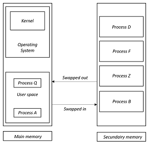
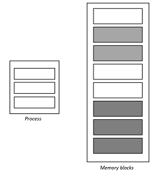
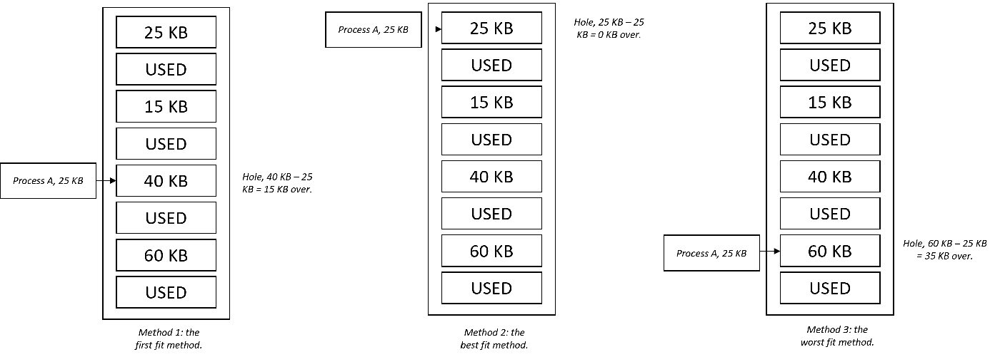
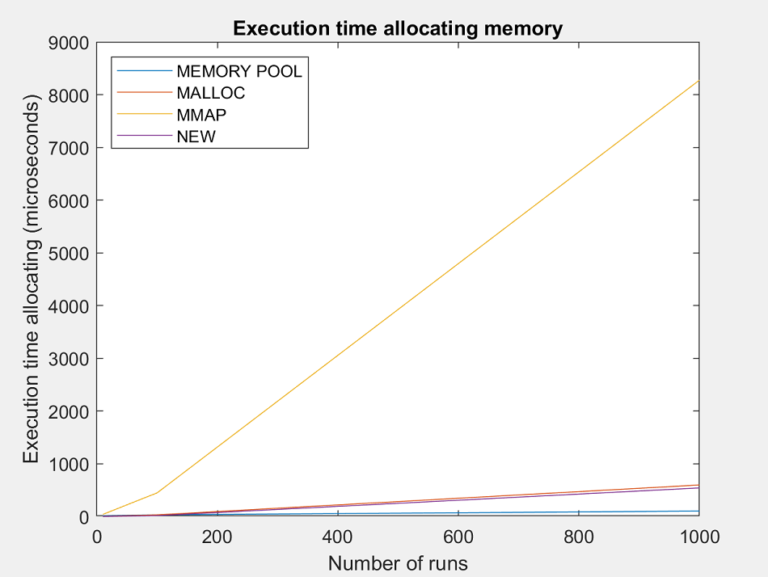

# Prose 'Let's allocate!'

**Content of this prose:**
```text
Content:
+ Introduction
| - + Research questions about allocators
| - + Applications of allocators
| - + Importance of allocators
| - + General goal of this prose
+ Obtaining memory from your operating system
| - + Memory management
| - + Different types of memory
| - + Contiguous memory allocation
| - + The allocation of memory
| - + Fragmentation
+ Algorithms, datastructures and dynamic memory
| - + Datastructures and their allocators
| - - + Implementing an allocator
| - - - + Trivia: functions for allocating memory in Linux
| - - + Size of allocation, creating objects of your type 'T'
| - - + Last step: defining operators
+ Standard allocators within C and C++
| - + Errors using these standard allocators
| - + Implementations of the standard allocators
+ Different allocators and their complexities
| - + All the types of allocators
| - - + Linear allocator
| - - + Stack allocator
| - - + Memory pool allocator
| - - + Free list allocator
| - + The next part: implementing a memory pool allocator
+ Implementing a memory pool allocator
| - + The implementation of blocks and chunks
| - + Benchmark time
+ What we have learned
+ What the writers have learned
+ References
```

## Introduction

In a computer program you can't get around it: variables. Values are stored here that are important in your program.
But there are several ways to allocate these variables. 

One way to do this is to dynamically allocate memory.
In this case, this allocation will have to take place on the heap. But this allocation is a complex problem in C++, along with C.
For example, memory allocation using `malloc` can be extremely slow if your operating system needs to contact its kernel to be able to allocate memory. This makes it possible to write an allocator yourself in order to influence performance.
There are also various allocators that you can implement yourself, such as a memory pool allocator. This allocator ensures, among other things, that less memory fragmentation takes place, and that the allocation of new elements is super-fast.

So: do you want to know everything about allocators? Then you've come to the right place! It examines how dynamic memory allocation works, along with the advantages and disadvantages associated with it. We also briefly look at algorithms that often require dynamic memory allocation. Finally, a memory pool allocator is written which is extensively tested (as also on its speed of memory allocation).

### Research questions about allocators

In connection with this prose, an examination is given. Various questions can be asked which must then be answered in this way. These questions naturally relate to the subject of allocators. The following research questions have been defined:

1. How are the allocators implemented within C/C++. This includes `::operator new` and `malloc`, together with `::operator delete` and `free`. _Here we look at which different implementations these operators/functions can have within an operating system. This means that it is evaluated which implementations are possible here, and how the efficiency of allocation/deallocation depends on this._
2. How does memory allocation work? _A very important aspect: how does your program actually get dynamic memory? Will your operating system be contacted, which will immediately return a fresh block of memory to you? Here it is mentioned, among other things, how memory is allocated dynamically._
3. What are the algorithms/data structures that often work with dynamic memory allocation? _Many complex data structures use memory that is dynamically allocated. For example for a `std::list<T>`, or a `std::vector<T>`. These data structures also have its uses for efficiently executing different algorithms._
4. What types of allocators are there? _As you might expect, there are many types of allocators. Some allocators are super-fast, and return the requested memory almost immediately, while other allocators take a little longer._
5. How does a memory pool allocator work, and how do you implement this type of allocator? _Here is explained how a memory pool allocator works, and how it is implemented. And you can already feel it coming, this allocator can allocate memory very quickly._

### Applications of allocators

In many ways the use of a standard allocator is sufficient, you request an amount of memory, in order to be able to use it. But in some cases the use of these allocators can be very slow. If the speed of the execution of your program matters, it may be important for this reason that you have to implement an allocator yourself. For example, if you allocate a lot of small pieces of memory with `::operator new`, this can be very slow. The operating system must also be contacted continuously, which in the worst case must contact its kernel.

You would prefer to avoid this problem, so you have to implement an allocator yourself. For example, it is possible to allocate a large block of memory at hand, and then divide it into smaller chunks when you request new memory. In this case, there is no need to contact the operating system to obtain memory. The allocation in this case is in constant time.

In addition, it can also be an important reason to implement your own allocator if you do not want to deal with a large memory fragmentation, so that many blocks of memory have been allocated for a program.

Because with the implementation you can drastically reduce the execution and the number of resource requests for your program than the standard applications that a programming language offers, this application is often used in business. For this reason it is important to follow a further study on the use of dynamic memory, its applications and the various types of allocators. Within C++, allocators are also used within STL algorithms and STL containers. Underlying this, one uses `std::allocator<T>`, which you can also implement completely yourself. You can then state that algorithms must use the allocator that you have implemented yourself. For a further explanation, and mentioning the importance of allocators, reference is made to the section below in this prose.

### Importance of allocators

Allocators are objects that are responsible for encapsulating memory management. They must be able to allocate and deallocate memory. This should always be done in these two steps. In addition, many algorithms use allocators, for example STL algorithms in C++. For example, various algorithms use a certain signature for the allocation, which corresponds to a `std::allocator<T>`.

However, it is also possible to generate an allocator yourself, but this must then meet the same requirements as set for a `std::allocator<T>`. It is therefore important that one knows which properties a self-defined allocator must meet, in order to be able to actually use it in STL algorithms.

In addition, it is also possible by implementing your own `std::allocator<T>` to use an allocation method other than `::operator new` or `malloc`. For example, you can use the direct allocation method used for Linux systems using `mmap` or `munmap` to request and release memory.
So it is important, for example, that you know what requirements `std::allocator<T>` must meet, and how you can implement them yourself. This is because many STL algorithms also use this, with underlying STL containers of course.

### General goal of this prose

A general introduction to allocators has already been given above. In addition, an application is mentioned, and the importance of the knowledge of allocators. The purpose of this process is therefore to clarify how allocators work, to be specific: how memory is obtained from your operating system, and how it is released respectively. In addition, various data structures are also given, and the applications of these structures with regard to algorithms. Note that these data structures at least make use of dynamic memory management.

To return to the world of C/C++, we look at the pros and cons of the standard allocators `malloc` and `::operator new`. Know that it is always possible to implement your allocator yourself, to use it in STL algorithms and STL containers.

Finally, different types of allocators are mentioned above, with the implementation of a memory pool allocator. The performance of allocators also plays an important role in this.

If this process is read through completely, the following objectives have been achieved:

1. You know how memory is obtained from your operating system, and how it is released.
2. You also know which data structures mainly use dynamic memory allocation and the algorithms that are used for this.
3. You know how `::operator new`, `malloc` with `::operator delete` and `free` respectively get memory through a function that can be used for this. In addition, you know which risks are associated with dynamic allocation of memory.
4. You know various types of allocators, along with their performance.
5. You can implement an allocator yourself, which, for example, meets the requirements for a `std::allocator<T>`.

**An extra point:** to increase the readability of this tutorial, short 'notification' has been used at some points in code snippets with explanations, which can be recognized by `/* ~~~ ... ~~~ */ `. A notice has been given here instead of the '...'. For example, reference can be made to source files of the code, or include files.

# Obtaining memory from your operating system

All the memory can only be supplied by one thing, that is the operating system. It goes without saying that your operating system can't allocate more memory than not release it at all. How an operating system does this, and how to properly maintain it, is given in this section.

## Memory management

In a multiprogramming computer (technique of utilizing several programs concurrently in a single computer system via multiprocessing), the operating system resides in a part of memory and the rest is used by multiple processes. The task of subdividing the memory among different processes is called memory management. Memory management is a method in the operating system to manage operations between main memory and disk during process execution. The main aim of memory management is to achieve efficient utilization of memory. 

## Importance of memory management

To allocate the best memory and distribute it correctly, an operating system uses memory management. This has a number of reasons, which are listed below:

* Allocate and de-allocate memory before and after process execution.
* To keep track of used memory space by processes.
* To minimize fragmentation issues.
* To proper utilization of main memory.
* To maintain data integrity while executing of process.

## Different types of memory

There are two types of memory in your computer. The first type of memory is main memory. This is occupied by your operating system, which in turn is occupied by the kernel. In addition, the main memory also consists of the 'user space', in which the data of executed programs is stored. To execute a program, it is moved from secondary memory to primary memory to which the program is executed. As a result, processes, often referred to as programs for convenience, are moved from secondary memory to primary memory when the program needs to be executed. When the output is ready, it is moved back to secondary memory. Multiple programs may be running in main memory at the same time. The image below provides an explanation of how processes switch memory.

<div style="display: flex">

</div>

<div style="text-align: center;">
Figure 1: visualization how processes/programs are swapped between the main memory, and secondary memory.
</div>

## Contiguous memory allocation

The main memory should oblige both the operating system and the different client processes.  Therefore, the allocation of memory becomes an important task in the operating system.  The memory is usually divided into two partitions: one for the resident operating system and one for the user processes. We normally need several user processes to reside in memory simultaneously. Therefore, we need to consider how to allocate available memory to the processes that are in the input queue waiting to be brought into memory. In adjacent memory allotment, each process is contained in a single contiguous segment of memory.

<div style="display: flex">

</div>

<div style="text-align: center;">
Figure 2: this is an example of contiguous memory allocation. Each process contains a contiguous block of memory.
</div>

## The allocation of memory

To gain proper memory utilization, memory allocation must be allocated efficient manner. One of the simplest methods for allocating memory is to divide memory into several fixed-sized partitions and each partition contains exactly one process. Thus, the degree of multiprogramming is obtained by the number of partitions.

There are several ways to allocate memory for a partition of a process:

1. Multiple partition allocation: in this method, a process is selected from the input queue and loaded into the free partition. When the process terminates, the partition becomes available for other processes. 
2. Fixed partition allocation: in this method, the operating system maintains a table that indicates which parts of memory are available and which are occupied by processes. Initially, all memory is available for user processes and is considered one large block of available memory. This available memory is known as 'hole'. When the process arrives and needs memory, we search for a 'hole' that is large enough to store this process. If the requirement fulfills then we allocate memory to process, otherwise keeping the rest available to satisfy future requests. While allocating memory, sometimes dynamic storage allocation problems occur, which concerns how to satisfy a request of size 'n' from a list of free holes.

As mentioned above, every operating system uses a number of ways to allocate memory. Assuming that the basis of the allocation is 'fixed partition allocation', the following methods are used for allocation:

1. First fit, here the first available fit is allocated immediately, if a 'hole' that is free meets the amount of memory to be allocated.
2. Best fit, here the smallest available block of memory is allocated that meets the requirements of the amount of memory to be allocated. In the worst case scenario, a whole list of memory is run through to find a block where the least amount of memory is 'wasted' and fragmentation can occur.
3. Worst fit, this is where the largest available block of memory is allocated. If this method is used, a lot of memory will remain, which was initially available for the allocation of a 'hole'.

<div style="display: flex">

</div>

<div style="text-align: center;">
Figure 3: these are the various methods of allocation, for each method a visualization is given how the operating system performs this.
</div>

## Fragmentation

Fragmentation is defined as when the process is loaded and removed after execution from memory, and it creates a small free hole. These holes can not be assigned to new processes because holes are not combined, or do not fulfill the memory requirement of a new process that wants a new block of memory.  To achieve a degree of multiprogramming, you must always reduce the waste of memory or fragmentation when allocating new memory for a process.

# Algorithms, datastructures and dynamic memory

Many data structures scale dynamically. This means that if you add new elements, for example, new memory will be allocated. In C++ many data structures also use `std::allocator<T>`. And you probably already feel it coming, algorithms are also performed on these data structures. This section lists some data structures and algorithms that can be performed on them.

## Datastructures and their allocators

C++ has many STL containers, which are so-called 'standard template libraries' containers. These containers can work with all standard algorithm times given in the `algorithms` header file. Some algorithms given herein are for example `std::sort` for sorting a container, or `std::find` for finding elements in a container.
The data below uses one STL container, which in this case is a `std::vector`. Normally you declare a vector like this: `std::vector<int>`, where the type of the container can only contain integers. Your vector automatically uses a `std::allocator<int>`. This type of allocator is developed by default within the `std` namespace, and if you don't specify your own written allocator it will be used.

However, it is also possible to give an allocator itself to an STL container. This means that you can code one yourself. This allocator must meet the [requirements](https://en.cppreference.com/w/cpp/named_req/Allocator) that your compiler sets here to be able to work with an allocator. An implementation is given in the section below, along with an explanation of how to implement an allocator yourself.

### Implementing an allocator

We start by creating a class called `mmap_allocator`. This allocator will eventually use the `mmap` and `munmap` functions provided for Linux systems to allocate/deallocate memory. We will explain how to use these two different functions later in this section.

To allow this allocator to be used for different types it is a `template`. This means that you can, for example, use this allocator to allocate memory for `int`s, `double`s or a compound type.
To start making our own allocator, a field will always have to be given, that is the field `typename T value_type`. This field must be publicly available as an STL container must be able to access it.

```c++
// This is the class 'mmap_allocator', used for allocating memory with 'mmap'.
template <typename T>
class mmap_allocator {
public:
    // You must specify this type definition within an allocator. It is a value type.
    [[maybe_unused]] typedef T value_type;
    
    /* ~~~ Here will come more functions for the allocator. ~~~*/
};
```

Then a number of constructors are given along with a destructor. For example, since an allocator will never have a state, it will not contain any private fields. For this reason, both the constructor and destructor can be specified as `default`. In addition, we also specify a `constexpr` constructor, which makes it possible to evaluate this class at compile time. This is often used within allocators. Your `template` class will now look like this:

```c++
// This is the class 'mmap_allocator', used for allocating memory with 'mmap'.
template <typename T>
class mmap_allocator {
public:
    // You must specify this type definition within an allocator. It is a value type.
    [[maybe_unused]] typedef T value_type;

    // This is the constructor of the 'mmap_allocator' class. It is a default constructor.
    mmap_allocator() = default;
    // This is the destructor of the 'mmap_allocator' class. It is a default destructor.
    ~mmap_allocator() = default;

    // The constexpr constructor for this allocator.
    template <typename U>
    [[maybe_unused]] constexpr explicit mmap_allocator (const mmap_allocator<U>& ) noexcept {}
    
    /* ~~~ Here will come more functions for the allocator. ~~~*/
};
```

Now comes the most important part of the allocator, the methods that allow the allocation and deallocation of memory. These methods have a number of parameters. The `allocate` method will include the number of elements for which memory must be allocated. This is never in bytes, this amount is calculated by doing `number_of_elements * sizeof(T)`. This method is also allowed to throw an exception. The `allocate` method will return a pointer to the first address of the block of memory that has been allocated. The `deallocate` method, on the other hand, has a parameter to the memory address to be deallocated, as well as the number of elements to be deallocated. Again, this is never given in bytes, which also means `number_of_elements * sizeof(T)` for the number of bytes.

```c++
// This is the class 'mmap_allocator', used for allocating memory with 'mmap'.
template <typename T>
class mmap_allocator {
public:
    /* ~~~ Here come all the constructors, skipped for brevity. ~~~ */

    // This method allocates new memory. In this case 'number_of_elements' is always the number of elements that you want to allocate. It is NOT in bytes!
    [[maybe_unused]] [[nodiscard]] T* allocate(std::size_t number_of_elements);

    // This method deallocates the allocated memory, allocated with the 'allocated' method. In this case must 'number_of_elements' be the same value as passed to the earlier called 'allocate' method.
    [[maybe_unused]] void deallocate(T* allocated_memory, std::size_t number_of_elements) noexcept;
    
    /* ~~~ Here will come more functions for the allocator. ~~~*/
};
```

The implementations of these two methods are crucial. To allocate memory, use is made of the facilities that Linux offers for this, namely `mmap`. This function is given in the header `sys/mman.h`, and must be given a `nullptr` as parameters, since you want to allocate a new block of memory. You can also specify how the processes may treat this block of memory. So we can read and write to it. In addition, no mapping is given for this memory. It is also checked whether the allocation of memory is just given, and therefore not equal to the macro `MAP_FAILED`. If the allocation is successful, the first address will be returned as type `T` for which memory is allocated.
If the allocation has failed an expectation is thrown, in this case `std::bad_alloc`. Note that the `allocate method can always throw an exception in any case.

To deallocate memory, the address to the current block must be passed to this `deallocate` method. This also includes the number of elements for which the memory must be released. To free the memory, the `munmap` method is used. If the memory is properly released, it can no longer be used. If this does happen, the program will crash immediately with a segmentation fault.
The syntax of this function is simple, you need to provide the address, along with the amount of bytes to deallocate. After this, this function will return a value when the memory is properly released. When the memory deallocation fails, this is pointed out to the user.

```c++
// This method allocates new memory. In this case 'number_of_elements' is always the number of elements that you want to allocate. It is NOT in bytes!
template<typename T>
[[maybe_unused]] T *mmap_allocator<T>::allocate(std::size_t number_of_elements) {
    auto* allocated_memory = mmap(nullptr, number_of_elements * sizeof(T), PROT_READ | PROT_WRITE, MAP_PRIVATE | MAP_ANONYMOUS, 0, 0); // Allocate a new memory block with 'mmap'. You can read/write to this memory. Also, the mapping is not mapped to a file.

    // Check if allocating new memory succeeded.
    if (allocated_memory == MAP_FAILED)
        throw std::bad_alloc(); // Allocating not succeeded. Throw this exception. Allowed within C++ -> allocating method.

    return reinterpret_cast<T*>(allocated_memory); // Cast the allocated block to your type 'T'.
}

// This method deallocates the allocated memory, allocated with the 'allocated' method. In this case must 'number_of_elements' be the same value as passed to the earlier called 'allocate' method.
template<typename T>
[[maybe_unused]] void mmap_allocator<T>::deallocate(T *allocated_memory, std::size_t number_of_elements) noexcept {
    // Here, you unmap the just allocated memory. You are passing the first address of the allocated block, together with the number of bytes.
    if (munmap(allocated_memory, number_of_elements * sizeof(T)))
        std::cerr << "Deallocating memory failed!" << std::endl; // If this function failed deallocating the memory, print this as standard error.
}
```

#### Trivia: functions for allocating memory in Linux

As observed in the code snippets above, Linux systems provide a library that can be used in both C/C++ programs regarding memory usage. This header is the `sys/mman.h` header. Two important functions are used from here, which is the `mman` function respectively together with the `munmap` function.
The signature of the `mman` function is given as follows: `void* mmap(void* address, size_t length, int prot, int flags, int fd, off_t offset)`. In our case we want to continuously allocate new memory, so the value of `address` will be a `nullptr` in any case. The length is always in bytes, obtained by multiplying the required elements by the size of the data type in bytes.
Then a number of macros are always passed for `prot`. In our case it is `PROT_READ | PROT_WRITE`. This indicates that the block of memory may be read as well as written. This can be achieved by applying the OR operator between the two macros.
Then the `flags`, which contain the value `MAP_PRIVATE | MAP_ANONYMOUS`, which means that the memory can also be visible to other processes.
Finally, the values `fd` and `offset` are given zero, since we don't want to have an offset for a block of memory to be allocated.

To deallocate memory we use `munmap`. The signature of this function is `int munmap(void* addr, size_t len)`. The first parameter represents the address of the memory that was dynamically allocated on-hand, and now needs to be freed up again. Then you name the number of bytes of this memory block for `len`. If the deallocate was successful this function will return zero, otherwise -1. If you now access memory released by `munmap` this will throw a segmentation fault.

### Size of allocation, creating objects of your type `T`

Now a number of additional methods follow. These are in principle optional, which means that an allocator does not have to be provided with these methods. One of these methods is the `max_size`, which specifies the maximum size that can be allocated.
A number of other methods are also worth implementing, namely the `construct` and `destruct` methods. Here the object `T` is constructed or deconstructed respectively.
The implementation of `construct` is simple but interesting. It looks like this: `new ((void*) allocated_memory) T(value)`. Now you're probably thinking: didn't we use `mmap`? But this is not the allocation of memory. In terms this is called the 'placement new', which constructs only an object `T`. This does not allocate memory for your allocator.
For the `destruct` method, the destructor is called from object `T` with `obj->~T()`. As mentioned, these methods are not mandatory within an allocator, but are worth mentioning to implement once.

```c++
// This is the class 'mmap_allocator', used for allocating memory with 'mmap'.
template <typename T>
class mmap_allocator {
public:
    /* ~~~ Here come all the constructors, skipped for brevity. ~~~ */

    // This method returns the maximum size that you can allocate.
    [[maybe_unused]] [[nodiscard]] std::size_t max_size() const;

    // This method constructs your type 'T'. Is has nothing to do with allocating memory with 'mmap'.
    [[maybe_unused]] void construct(T* allocated_memory, const T& value);

    // This method destroys your type 'T'. It has nothing to do with deallocating memory with 'munmap'.
    [[maybe_unused]] void destroy(T* object_to_destroy);
        
    /* ~~~ Here will come more functions for the allocator. ~~~*/
};

/* ~~~ Here comes the implementation of those member functions. ~~~ */

// This method returns the maximum size that you can allocate.
template<typename T>
[[maybe_unused]] std::size_t mmap_allocator<T>::max_size() const {
    return std::numeric_limits<std::size_t>::max() / sizeof(T); // Calculate the amount of allocating memory.
}

// This method constructs your type 'T'. Is has nothing to do with allocating memory with 'mmap'.
template<typename T>
[[maybe_unused]] void mmap_allocator<T>::construct(T *allocated_memory, const T &value) {
    new ((void*) allocated_memory) T(value); // Construct object 'T'. You are using 'placement new', that is different from allocating.
}

// This method destroys your type 'T'. It has nothing to do with deallocating memory with 'munmap'.
template<typename T>
[[maybe_unused]] void mmap_allocator<T>::destroy(T *object_to_destroy) {
    object_to_destroy->~T(); // Destruct the object of 'T'.
}
```

### Last step: defining operators

As a last step, a number of operator overloads are often given for allocators, namely for the `==` and `!=` operators. In the first case, 'true' is always returned, and in the other case, 'false'. This is always the case if two `mmap` allocators of `T` and `U` are compared.

```c++
// This operator compares two 'mmap' allocators.
template <typename T, typename U>
bool operator==(const mmap_allocator<T>&, const mmap_allocator<U>&) { return true; }

// This operator compares two 'mmap' allocators.
template <typename T, typename U>
bool operator!=(const mmap_allocator<T>&, const mmap_allocator<U>&) { return false; }
```

### Use with STL-containers and STL-algorithms

Now that you have implemented an allocator yourself, and know what all its requirements are, you can use it for STL containers, such as a `std::vector` or a `std::list`. It is also possible to execute various STL algorithms, which are given in the header `algorithm`. This means that by means of your own implementation of an allocator you have a lot of freedom in the algorithms that can be performed with it, or in the choice of a container. The code snippet below shows a simple program that uses the `mmap_allocator`, along with a number of algorithms (these are all STL algorithms).

```c++
#include <vector> // Include here all the 'vector' facilities.
#include <list> // Include here all the 'list' facilities.
#include <iostream> // Include here all the 'iostream' facilities.
#include <algorithm> // Include here all the 'algorithm' facilities.

#inlude "mmap_allocator.h" // Include here all the 'mmap_allocator' facilities.

int main() {
    std::list<int, mmap_allocator<int>> list{3, 7, 1, 2, 11, 0, 14}; // A list with values. It uses a custom allocator.
    std::vector<int, mmap_allocator<int>> vec{3, 7, 1, 2, 11, 0, 14}; // A vector with values. It uses a custom vector.

    list.sort(); // Sort the list.
    std::sort(vec.begin(), vec.end(), [] (int first_value, int second_value) { return first_value < second_value; }); // Sort the vector. This is an STL-algorithm.

    std::for_each(list.begin(), list.end(), [] (int value) { std::cout << "List value: " << value << std::endl; }); // Print the content. This is an STL-algorithm.
    std::for_each(vec.begin(), vec.end(), [] (int value) { std::cout << "Vector value: " << value << std::endl; }); // Print the content. This is an STL-algorithm.

    std::cout << "Maximum vector element: " << *std::max_element(vec.begin(), vec.end()) << std::endl; // Find the maximum element of the vector. This is an STL-algorithm.
    std::cout << "Minimum list element: " << *std::min_element(list.begin(), list.end()) << std::endl; // Find the minimum element of the list. This is an STL-algorithm.
}
```

# Standard allocators within C and C++

C++ has a well-known allocator that allocates memory, namely `::operator new`. To deallocate memory use `::operator delete`. Actually, it uses the functions that C has for this, `malloc` and `free`. In this section, both the pros and cons of these allocators are given.

## Errors using these standard allocators

Within low level programming languages, such as C/C++, dynamic allocation is a very complex problem. A large number of errors can occur here, in which a program can even crash due to segmentation faults. The most common memory allocation issues in C/C++ are as follows:

1. Not checking for allocation failures. Memory allocation is not guaranteed to succeed, and may instead return a `nullptr`. Using the returned value, without checking if the allocation is successful, invokes undefined behavior. This usually leads to crash (due to the resulting segmentation fault on the `nullptr` dereference), but there is no guarantee that a crash will happen so relying on that can also lead to problems.
2. Memory leaks. Failure to deallocate memory using free leads to buildup of non-reusable memory, which is no longer used by the program. This wastes memory resources and can lead to allocation failures when these resources are exhausted.
3. Logical errors. All allocations must follow the same pattern: allocation using `malloc` or `::operator new`, usage to store data, deallocation using `free` or `::operator delete`. Failures to adhere to this pattern, such as memory usage after a call to `free`/`::operator delete` (this is called a dangling pointer) or before a call to `malloc`/`::operator new` (this is called a wild pointer), calling `free`/`::operator delete` twice ("double free"), usually causes a segmentation fault and results in a crash of the program. These errors can be transient and hard to debug. For example, freed memory is usually not immediately reclaimed by the operating system, and thus dangling pointers may persist for a while and appear to work.

## Implementations of the standard allocators

The implementation of memory management depends greatly upon operating system and architecture. Some operating systems supply an allocator for `malloc`, while others supply functions to control certain regions of data. The same dynamic memory allocator is often used to implement both `malloc` and the `::operator new` in C++.

1. Heap base implementation. Implementation of the allocator is commonly done using the heap, or data segment. The allocator will usually expand and contract the heap to fulfill allocation requests.
2. Implementation with `dlmalloc`. Here, `dlmalloc` is a boundary tag allocator. Memory on the heap is allocated as 'chunks', an 8-byte aligned data structure which contains a header, and usable memory.
3. Implementation with FreeBSD's and NetBSD's `jemalloc`. In this case, the old implementation of `malloc` is replaces by `jemalloc`.
4. Implementation with OpenBSD's `malloc`. OpenBSD's implementation of the `malloc` function makes in this case use of `mmap` (just as we created an allocator with).
5. Implementation with Hoard `malloc`. Hoard is an allocator whose goal is scalable memory allocation performance. Like OpenBSD's allocator, Hoard uses `mmap` exclusively, but manages memory in chunks in bigger blocks.
6. Implementation with `mimalloc`. This is an open-source compact general-purpose memory allocator from Microsoft Research with focus on performance.
7. Implementation with a 'thread-caching malloc'. In this approach, every thread has a thread-local storage for small allocations. For large allocations `mmap` is used.
8. Implementation with DFWMalloc. This approach is a highly-configurable malloc library employing lock-free functionality.
9. Using your kernel, allocation in-kernel. Operating system kernels need to allocate memory just as application programs do. For this reason, allocation within your kernel is often used.

The choice of these implementations of the allocators offered in the C/C++ standard can also have a major influence on the speed of the allocation. For example, the `dlmalloc` can allocate memory faster, since it uses 'chunks'. A larger amount of memory remains available, with the allocation proceeding in smaller steps. This comparison is made with, for example, the heap-based implementation.
In addition, many methods also use the `mmap` allocator, as this method is provided by default within several operating systems, such as Linux (or other Unix-based systems). Sometimes a variation is given to make the allocation even faster, or to allocate larger blocks of memory with this allocator.

# Different allocators and their complexities

You have already seen a number of allocators, such as the standard allocators that use C/C++. This also together with ways how these allocators can be implemented. You have also seen an implementation that itself implements an allocator with `mmap`. But it is possible to allocate memory in faster ways. For this you have to deal with different types of allocators, such as a so-called 'memory pool allocator'. In this section, various allocators are mentioned, along with the associated complexities of allocating and releasing dynamic memory.

## All the types of allocators

You can also define allocators yourself, which can allocate memory faster. This has to do with the fact that every program has certain needs regarding allocation, for example. If you implement an allocator yourself, this is a 'custom allocator'. In this way you can increase efficiency and performance.
Note that this is a full custom allocator, with the allocation completely different from that implemented in the above section of this prose, the `mmap_allocator` to be precise. These custom allocators mainly aim to speed up the allocation in order to indeed increase the performance of a program.

In general, custom allocators share properties, which are the following properties:
1. Low number of allocations, any custom allocator tries to keep the number of allocations low. To do that, they allocate big chunks of memory and then, they manage this chunk internally to provide smaller allocations.
2. Internal data structures, to increase the performance of allocation, allocators use an internal data structure. This can be, for example, a linked list or a stack. These keep track of the amount of free or occupied memory. In addition, they also speed up the operation of the allocation or release of memory.
3. Constraints, some allocators are very specific and have constraints over the data or operations that can be performed. This allows them to achieve a high performance but can only be used in some applications.

Now that you have named the properties of full custom allocators, you can also implement the following allocators yourself.

### Linear allocator

This is the simplest kind of allocator. The idea is to keep a pointer at the first memory address of your memory chunk and move it every time an allocation is done. In this allocator, the internal fragmentation is kept to a minimum because all elements are sequentially (spatial locality) inserted and the only fragmentation between them is the alignment.
This allocator only requires a pointer (or an offset) to tell us the position of the last allocation. It doesn't require any extra information or data structure.
Due to its simplicity, this allocator doesn't allow specific positions of memory to be freed. Usually, all memory is freed together.

The time complexity to allocate memory is extremely fast, this happens in O(1) time. This is because all you need to do is change the offset and immediately free up memory. This time is almost constant as one large block of memory is immediately allocated instead of small blocks of memory when new memory is requested.

### Stack allocator

This is a smart evolution of the linear allocator. The idea is to manage the memory as a Stack. So, as before, we keep a pointer to the current memory address, and we move it forward for every allocation. However, we also can move it backwards when a free operation is done. As before, we keep the spatial locality principle and the fragmentation is still very low.
As said, we need the pointer (or offset) to keep track of the last allocation. In order to be able to free memory, we also need to store a header for each allocation that tell us the size of the allocated block. Thus, when we free, we know how many positions we have to move back the pointer/offset to free memory.

Here the complexity of the allocator depends on two variables. That is the size of a header, along with the number of allocations. This can be described as O(h * n), where 'h' is the size of a header, and 'n' is the number of allocations. Since the size of a header is always constant, the complexity is transformed into O(n). If after creating a block of memory and dividing it into a stack, you can allocate and release this memory in almost constant time, O(1). Your stack in this case monitors the available/occupied memory.

### Memory pool allocator

A memory pool allocator is quite different from the previous ones. It splits a big memory block in smaller chunks of the same size and keeps track of which of them are free. When an allocation is requested it returns the free chunk size. When a freed is done, it just stores it to be used in the next allocation. This way, allocations work super-fast and the fragmentation is still very low.
To keep track of the free chunks within a big block of memory, a memory pool allocator uses a linked list. A large block of memory is divided into smaller chunks, with each chunk containing an address to its next chunk.

Because each chunk contains an address to the next available chunk, getting memory is very fast, namely in O(1) time. Also freeing memory in constant time, as you can move a block of memory to the back of the internal linked list which can then be used for another chunk.

### Free list allocator

This is a general purpose allocator that, contrary to the previous allocators, doesn't impose any restriction. It allows the allocation and deallocation to be done in any order. For this reason, its performance is not as good as its predecessors (this means that allocating and deallocating memory takes more time). Depending on the data structure used to speed up this allocator, there are two common implementations: one that uses a linked list and one that uses a red black tree.

**Using a linked list:**

As the name says, this implementation uses a linked list to store, in a sorted manner, the start address of each free contiguous block in memory and its size. When an allocation is requested, it searches in the linked list for a block of memory where the data can fit. Then it removes the element from the linked list and places an allocation header (that is always used on the deallocation of memory) right before the data. During the deallocation of memory, we get back the allocation header to know the size of the block that we are going to free. Once we free it we insert it into the sorted linked list. After this we try to merge contiguous memory blocks together creating bigger blocks of memory.
Since memory has to be searched within this linked list, the complexity of allocating is O(n). The same is true for memory deallocation.

**Using a red black tree:**

Using red black trees we can reduce its complexity to O(log(n)) while keeping space complexity quite low, because the tree data is stored inside the free memory blocks. In addition, this structure allows a best-fit algorithm to be used, reducing the fragmentation and keeping performance. 

## The next part: implementing a memory pool allocator

A memory pool allocator is implemented in the next section. This allocator will allocate a large block of memory at once, which is divided into smaller chunks. Each chunk contains an address to the next chunk, giving it the properties of a linked list. If you allocate, a chunk is returned in which data can be stored. If you release a chunk again, it can also be 're-used' again by just changing the address of its next chunk for your next chunk. As a result, the deal location is also almost constant. The most expensive operation of this allocator is therefore to allocate one large block of memory and divide it into separate chunks.

# Implementing a memory pool allocator

Now the time has come for you to implement an allocator with all the knowledge you have acquired, in this case a memory pool allocator which in turn makes use of `mmap` and `munmap` underwater. To allow multiple blocks with chunks to be allocated, a vector containing a list of chunks is used. This is allowed within a memory pool allocator. After this effort, the speed of the memory pool allocator is compared with other allocators.

## The implementation of blocks and chunks

To allow for allocating multiple blocks of chunks, a vector is used, which contains all the chunks associated with a single block of memory. This vector uses a self-defined allocator, in this case the `block_allocator`. This class has two methods `allocate` and `deallocate` to allocate memory for this vector. For the actual allocation use is made of `mmap` and `munmap` respectively. For the full implementation, reference is made to the [code](inc/block_allocator.h).

```c++
// This is the template class 'block_allocator', used for allocating memory for a new block for the memory pool allocator.
template <typename T>
class block_allocator {
public:
    // You must specify this type definition within an allocator. It is a value type.
    [[maybe_unused]] typedef T value_type;

    // This method allocates new memory. In this case 'number_of_elements' is always the number of elements that you want to allocate. It is NOT in bytes!
    [[maybe_unused]] T* allocate (std::size_t number_of_elements);

    // This method deallocates the allocated memory, allocated with the 'allocated' method. In this case must 'number_of_elements' be the same value as passed to the earlier called 'allocate' method.
    [[maybe_unused]] void deallocate(T* memory, std::size_t number_of_elements) noexcept;

    /* ~~~ Here are more methods, skipped for brevity. ~~~ */
};

/* ~~~ The implementation of these methods has been omitted, it is the same as given within the 'mmap_allocator', please refer to this for further explanation. ~~~ */
```

Now let's go to the `pool_allocator` class, which actually implements the memory pool. First, this class has a number of fields, including some important fields. The `m_block_list` field represents a list of blocks that can contain chunks. It is also possible to have multiple blocks dynamically. A custom allocator is also used for this field, such as the signature given above. The field `m_current_block` is a pointer that monitors the current block of memory that still contains free chunks.

The constructor of this class is self-explanatory. However, the destructor goes through all blocks within `m_block_list`, releasing all lists containing chunks. So it deallocates the memory for all chunks.

```c++
// This is the 'pool_allocator' class, that represents a memory pool allocator.
template <typename T>
class pool_allocator {
public:
    /// This is the constructor of the 'memory_pool' allocator class.
    explicit pool_allocator(const std::size_t& chunk_per_blocks);

    // This is the destructor of the 'memory_pool' allocator class.
    ~pool_allocator();

    /* ~~~ Here are more methods, skipped for brevity. ~~~ */

private:
    std::vector<chunk_list<T>, block_allocator<chunk_list<T>>> m_block_list; // This field is a vector of blocks, that uses a custom allocator. This is a design decision, so that you can allocate multiple blocks, with chunks. This is allowed within a memory pool allocator.
    chunk_list<T>* m_current_block; // This list of chunks to your current block with not yet allocated chunks.
    std::size_t m_current_chunk; // The number of chunks per block.
    std::size_t m_chunks_per_block; // The number of chunks per block.
};

// This is the constructor of the 'memory_pool' allocator class.
template<typename T>
pool_allocator<T>::pool_allocator(const std::size_t &chunk_per_blocks) :
    m_block_list{},
    m_current_block{nullptr},
    m_current_chunk{chunk_per_blocks},
    m_chunks_per_block{chunk_per_blocks}
{}

// This is the destructor of the 'memory_pool' allocator class.
template<typename T>
pool_allocator<T>::~pool_allocator() {
    // Go through all the blocks, deallocate the memory for the list of chunks.
    for (auto& single_block : m_block_list)
        single_block.remove_chunk_list();
}
```

Now the allocation of a new block of memory follows, which is done in the `allocate` method. If there are no more free chunks available for a block, a new one is added to the vector `m_block_list`. Your current block with now free chunks will now get the address of the recently created block. Some fields are changed, so that it is again possible to return new chunks. To release chunks, a method is called on `m_current_block`. This releases a single chunk. The number of chunks used for your current block is also reduced, as a block has been released for this respectively.

```c++
// This is the 'pool_allocator' class, that represents a memory pool allocator.
template <typename T>
class pool_allocator {
public:
    /* ~~~ Here are more methods, skipped for brevity. ~~~ */

    // This method allocates memory for a new chunk.
    [[maybe_unused]] chunk<T>* allocate();

    // This method releases memory for an allocated chunk.
    [[maybe_unused]] void deallocate(chunk<T>* release_chunk) noexcept;

    /* ~~~ Here are more methods, skipped for brevity. ~~~ */

private:
    std::vector<chunk_list<T>, block_allocator<chunk_list<T>>> m_block_list; // This field is a vector of blocks, that uses a custom allocator. This is a design decision, so that you can allocate multiple blocks, with chunks. This is allowed within a memory pool allocator.
    chunk_list<T>* m_current_block; // This list of chunks to your current block with not yet allocated chunks.
    std::size_t m_current_chunk; // The number of chunks per block.
    std::size_t m_chunks_per_block; // The number of chunks per block.
};

// This method allocates memory for a new chunk.
template<typename T>
[[maybe_unused]] chunk<T> *pool_allocator<T>::allocate() {
    // Check if you have not reached the end of a block.
    if (m_current_chunk == m_chunks_per_block) {
        m_block_list.push_back(chunk_list<T>{m_chunks_per_block}); // Create a new block with chunks.
        m_current_block = &m_block_list.back(); // Change your current block.
        m_current_chunk = 0; // Your number of chunk is zero, you can allocate new memory.
    }

    m_current_chunk++; // Increment the number of chunks that indicates the amount of allocated memory.
    return m_current_block->get_free_chunk(); // Get a free chunk.
}

// This method releases memory for an allocated chunk.
template<typename T>
[[maybe_unused]] void pool_allocator<T>::deallocate(chunk<T>* release_chunk) noexcept {
    m_current_block->remove_chunk(release_chunk); // Remove a specific chunk.
    m_current_chunk--; // You freed a chunk, decrement the number of allocated chunks for your current block.
}
```

Having discussed the implementation of the `pool_allocator`, the signature of a single chunk is given. This is a structure called `chunk` that contains two fields. Of these, one field is a data field, in which values of type `T` are stored, and the field `m_next_node` contains the address of the next available node if memory is re-allocated.

```c++
// This structure is used within a memory pool allocator. It contains a data element, together with the address to the next chunk.
template <typename T>
struct chunk {
    T m_data; // This is your data field.
    chunk* m_next_node; // This is the value to the next node field. It is a memory address.
};
```

Having given the definition of a single `chunk`, a sequel is given for a list of chunks, namely the class `chunk_list`. The main methods of this class are given in the signature below. These methods mainly deal with getting chunks, and removing them. Only these methods will be briefly explained. For a full implementation reference is made to the [code](inc/chunk_list.h).

```c++
// This is the class 'chunk_list'. It is used to allocate/deallocate memory for the list of chunks for a block in your memory pool allocator.
template <typename T>
class chunk_list {
public:
    /* ~~~ Here are more methods, skipped for brevity. ~~~ */
    
    // This method gets a free chunk from your current block of chunks.
    chunk<T>* get_free_chunk();

    // This method removes a just allocated chunk. Due to that you are using a linked list under the hood, you are only chancing the 'm_next_node' field from this struct.
    void remove_chunk(chunk<T>* free_chunk) noexcept;

    /// This method removes the whole list of chunks. It deallocates the whole block of memory.
    void remove_chunk_list() noexcept;

private:
    chunk<T>* m_current_chunk; // This field will hold the address to the current chunk.
    chunk<T>* m_begin_chunk; // This field will hold the address to the first chunk.

    /* ~~~ Here are more fields, skipped for brevity. ~~~ */
};
```

The `allocate` method checks whether a block of memory for all chunks has already been created. If this is not the case, `mmap` will allocate a block of memory in which the number of chunks will fit. If the allocation is successful, something interesting takes place, this is seen in the `for` loop. The large block of memory is divided into smaller blocks of memory, the size of your `chunk<T>` (you are actually creating a linked list). Based on this, `current_memory_element` is used to run through the entire memory, and an address for the next available chunk is also determined.
This method ensures that for several elements one large block of memory is allocated, which is divided for smaller elements. This way, less memory fragmentation occurs, and you only need to allocate once for your specified number of chunks.
Finally, an available chunk is immediately returned that can be used.

```c++
// This method gets a free chunk from your current block of chunks.
template<typename T>
chunk<T> *chunk_list<T>::get_free_chunk() {
    // Check if you never allocated new memory for you current block.
    if (m_current_chunk == nullptr) {
        auto* allocated_memory = reinterpret_cast<chunk<T>*>(mmap(nullptr, m_size_block, PROT_READ | PROT_WRITE, MAP_PRIVATE | MAP_ANONYMOUS, 0, 0)); // Allocate a new memory block with 'mmap'. You can read/write to this memory. Also, the mapping is not mapped to a file.

        // Check if allocating succeeded.
        if (allocated_memory != MAP_FAILED) {
            auto* current_memory_element = allocated_memory; // Indication for your current memory address.

            /* ~~~ Some more code comes here. ~~~ */

            // Go through the allocated block of memory, and divide smaller parts for single chunks. This allows for less fragmentation within you memory.
            for (std::size_t i = 0; i < m_number_of_chunks - 1; i++) {
                current_memory_element->m_next_node = reinterpret_cast<chunk<T>*>(reinterpret_cast<char*>(current_memory_element) + sizeof(chunk<T>)); // Allocate memory for a single chunk out of the bigger block of memory.
                current_memory_element = current_memory_element->m_next_node; // Go to the next chunk, you also want to allocate memory for the next chunk, unless you reached the maximum number of chunks.
            }

            current_memory_element->m_next_node = nullptr; // Last in the block of memory, it must be a 'nullptr'.
            m_current_chunk = allocated_memory; // First element in the allocated block of memory.
        }
        else
            throw std::bad_alloc(); // Allocating failed, throw this exception.
    }

    auto* free_memory_chunk = m_current_chunk; // Get free memory.
    m_current_chunk = m_current_chunk->m_next_node; // Go to the next chunk, your old chunk will be returned (first available place in memory). Allocating here goes in O(1) time.

    return free_memory_chunk; // Return the free chunk.
}
```

It can of course happen that you no longer use a chunk. For this you can 'release' it again in the `remove_chunk` method. It has the address of a chunk as a parameter. Based on this you see that the contents of the internal linked list of the memory pool allocator is changed, so that this chunk can be reused if requested.
If you want to release an entire list of chunks, this is done with the `remove_chunk_list` method. This removes the allocated block of memory by calling `munmap`. You can see that this block of memory is being deallocated in one go. This is because you initially also asked for this block, and it has been allocated. Later you divided it into smaller pieces, chunks.
This will be seen as one large block of memory, and is therefore also released in one go. This is in contrast to an explicit linked list, where you have to release memory element by element.
Here you can also see a nice example that there is almost no memory fragmentation for a large number of chunks that can be accommodated in this block of memory.

```c++
// This method removes a just allocated chunk. Due to that you are using a linked list under the hood, you are only chancing the 'm_next_node' field from this struct.
template<typename T>
void chunk_list<T>::remove_chunk(chunk<T> *free_chunk) noexcept {
    reinterpret_cast<chunk<T>*>(free_chunk)->m_next_node = m_current_chunk; // This chunk is now at the end of your list.
    m_current_chunk = reinterpret_cast<chunk<T>*>(free_chunk); // Your current chunk, if you ask new memory, it will return the address of 'free_chunk'. This is allowed within a memory pool allocator.
}

// This method removes the whole list of chunks. It deallocates the whole block of memory.
template<typename T>
void chunk_list<T>::remove_chunk_list() noexcept {
    // Here, you unmap the just allocated memory. You are passing the first address of the allocated block, together with the number of bytes.
    if (munmap(m_begin_chunk, m_size_block))
        std::cerr << "Deallocating memory failed!" << std::endl; // If this function failed deallocating the memory, print this as standard error.
}
```

Now we have implemented a memory pool allocator ourselves. Now it becomes interesting to actually see whether this allocator quickly frees up memory, along with a number of elements. For example, you can make this comparison like this for the same conditions with `::operator new` with `::operator delete`.

## Benchmark time

Now it's time to test different allocators, including the memory pool allocator. This was done using a benchmarker, which tests a number of allocators under the same conditions. These circumstances include the size of the memory, together with the number of times the memory is allocated/deallocated. For a given memory size, the average execution time is calculated corresponding to the number of executions. Thus, the accuracy of the benchmarker is increased as the average is taken. A number of allocators are used that are named within this process. These are the following allocators:

1. The memory pool allocator, this allocator is self-implemented using `mmap` underwater. This allocator is benchmarked to actually guarantee the efficiency of this allocator.
2. The `malloc` allocator, as much has been mentioned this within this process. It can also be examined how quickly this allocates memory.
3. The `mmap` allocator, as this is also used within the memory pool allocator. However, now this function is called for every new element, so you can predict that the output of this allocator should be slower than the memory pool allocator.
4. For the `new` allocator the same applies as for the `malloc` allocator. This allocator is often used within C++, and is often named within this process.

The image below shows a visualization of the benchmark of the various allocators. All four allocators mentioned above are given herein, and benchmarked under the same conditions. The program that generates the plot is compiled in `release` mode, which makes the program optimize. The result is given as follows:

<div style="display: flex">

</div>

<div style="text-align: center;">
Figure 4: the results of the benchmark, various allocators are compared here with regard to the speed of allocation/deallocation..
</div>

The memory pool allocator is the fastest, as predicted. Indeed, this is because a large block of memory is allocated only once, and then returns smaller chunks. You see that the allocation of memory takes place in almost constant time. However, the larger the block of memory that the pool allocator initially allocates, the longer the execution of this allocator is within the benchmark.
The pool allocator is followed by the allocators provided by default in C/C++ (these are of course `malloc`, `free`, `::operator new` and `::operator delete`). These are slower than the pool allocator, as here a new block of memory is allocated for each new element. Unlike the memory pool allocator chunks are returned within a memory block.
The slowest allocator is the `mmap` allocator. For each new element to be allocated/deallocated, the operating system is contacted again, which then returns the memory.

What is striking to see is the big difference between `mmap` and the allocators within C/C++. This is because the allocators within C or C++ often use `mmap`.

But as mentioned in section '_Implementations of the standard allocators_' within this process there are several implementations of these standard C/C++ allocators. Thus, the respective implementation of these allocators does not constantly call the `mmap` function for a new block of memory. It can therefore be, for example, an implementation according to the principles defined within OpenBSD or Hoard. A standard allocator within C/C++ is therefore not really that 'standard' at all, you can also use it as a custom allocator (😉).

A perk: it is very likely that both `malloc` and `::oeprator new` use the same implementation regarding allocation. This is because these lines are very close to each other within the graph above. There is therefore a chance that both are using the same implementation, which may be one of these as mentioned in section '_Implementations of the standard allocators_' in this process.

# What we have learned

You should have gained a lot of information about memory allocation and deallocation within a program that you can write. We looked at how an operating system does this, and how a programming language writes functions for this. We looked at standard allocators/deallocators in C and C++, and the various types of implementations of these functions in these respective programming languages. We also looked at various functions provided on Linux/Unix systems for memory allocation.
Based on this, an implementation of a memory pool allocator has been given. Various types of allocators have been tested in a benchmark, on which their performance is clearly visible. This benchmark even makes it possible to generate certain assumptions that apply to the standard allocators within C and C++.
We also looked at how you can make your own allocator, which can be used within STL containers and STL algorithms in C++.
All in all, many topics have been discussed, exposing the world of allocators in low level programming languages such as C and C++.

The following points should be clear:

1. You know how an operating system searches for free memory, and can mention these methods.
2. You know how to implement an allocator yourself within C++, that you can use on STL-containers and algorithms.
3. You know how `::operator new`, `malloc` with `::operator delete` and `free` can be implemented, and what the pitfalls are of these functions.
4. You know various types of allocators, along with their performance.
5. You can implement an amazingly fast allocator, called a memory pool allocator.

# What the writers have learned

The authors of this process have learned a lot about allocation within C and C++. This gives you an awareness that this allocation can indeed be a complex problem, which is a costly operation. This can make it attractive to implement an allocator yourself.
Moreover, it is also important that we now know which complexities an allocator can have, which can certainly influence the execution of a program.

All in all, we thought it was an interesting subject, which does have great complexity. This makes it easy to get segmentation faults within the implementation of allocators, which of course you also have to solve. This is also an instructive process, because it also teaches you what fragmentation is and how to divide a block of memory into smaller chunks, for example.

# References

The following resources were used during the generation of this entire project. It contains both the resources used during the implementation generation for the project, along with various theoretical aspects.

* Wikipedia's contributors. (2021, 10 November). Allocator (C++). Wikipedia. Read on 9 January 2022, from https://en.wikipedia.org/wiki/Allocator_(C%2B%2B)
* StackOverflow. (2012, 22 September). Memory Pool vs. malloc. Read on 9 January 2022, from https://stackoverflow.com/questions/12545044/memory-pool-vs-malloc
* CppReference. (2019, 21 April). C++ named requirements: Allocator - cppreference.com. Read on 9 January 2022, from https://en.cppreference.com/w/cpp/named_req/Allocator
* CodeTD. (2020, 4 January). C/C++ uses mmap/munmap function to allocate memory - Code World. Read on 9 January 2022, from https://www.codetd.com/en/article/12255921
* Carnie, G. (2019, 11 April). Thanks for the memory (allocator). Sticky Bits - Powered by Fabias. Read on 9 January 2022, from https://blog.feabhas.com/2019/03/thanks-for-the-memory-allocator/
